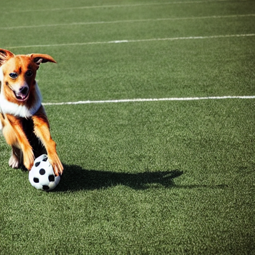
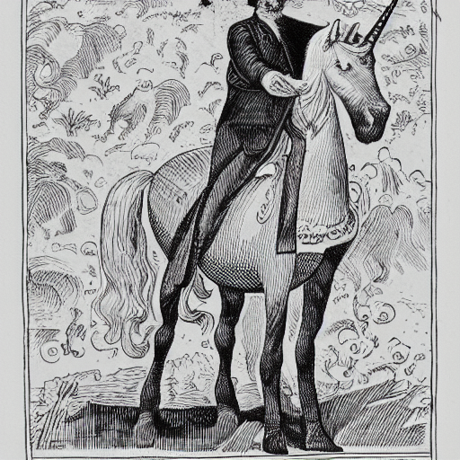

# stable-diffusion-pytorch

[Open in Colab](https://colab.research.google.com/github/CrypticOwl5503/stable-diffusion/blob/master/demo.ipynb)

## General Overview

Stable Diffusion combines ideas from diffusion models and deep learning to generate high-quality images from textual prompts or other images. It operates on the principle of simulating the gradual diffusion of noise in a probabilistic manner to generate realistic images.

## Results

### Text to Image



Prompt: Dog playing football



Prompt: Man on a horse

### Image to Image

Prompt:


Result:


## Dependencies

* PyTorch
* Numpy
* Pillow
* regex
* tqdm

## How to Install

1. Clone or download this repository.
2. Install dependencies: Run `pip install torch numpy Pillow regex` or `pip install -r requirements.txt`.
3. Download `data.v20221029.tar` from [here](https://huggingface.co/jinseokim/stable-diffusion-pytorch-data/resolve/main/data.v20221029.tar) and unpack in the parent folder of `stable_diffusion_pytorch`. Your folders should be like this:
```
stable-diffusion-pytorch(-main)/
├─ data/
│  ├─ ckpt/
│  ├─ ...
├─ stable_diffusion_pytorch/
│  ├─ samplers/
└  ┴─ ...
```
## How to Use

Import `stable_diffusion_pytorch` as submodule.

Text-to-image generation:
```py
from stable_diffusion_pytorch import pipeline

prompts = ["a photograph of an astronaut riding a horse"]
images = pipeline.generate(prompts)
images[0].save('output.jpg')
```

...with multiple prompts:
```
prompts = [
    "a photograph of an astronaut riding a horse",
    ""]
images = pipeline.generate(prompts)
```

...with unconditional(negative) prompts:
```py
prompts = ["a photograph of an astronaut riding a horse"]
uncond_prompts = ["low quality"]
images = pipeline.generate(prompts, uncond_prompts)
```

...with seed:
```py
prompts = ["a photograph of an astronaut riding a horse"]
images = pipeline.generate(prompts, uncond_prompts, seed=42)
```


Image-to-image generation:
```py
from PIL import Image

prompts = ["a photograph of an astronaut riding a horse"]
input_images = [Image.open('space.jpg')]
images = pipeline.generate(prompts, input_images=images)
```

...with custom strength:
```py
prompts = ["a photograph of an astronaut riding a horse"]
input_images = [Image.open('space.jpg')]
images = pipeline.generate(prompts, input_images=images, strength=0.6)
```

Change [classifier-free guidance](https://arxiv.org/abs/2207.12598) scale:
```py
prompts = ["a photograph of an astronaut riding a horse"]
images = pipeline.generate(prompts, cfg_scale=11)
```

...or disable classifier-free guidance:
```py
prompts = ["a photograph of an astronaut riding a horse"]
images = pipeline.generate(prompts, do_cfg=False)
```

Reduce steps (faster generation, lower quality):
```py
prompts = ["a photograph of an astronaut riding a horse"]
images = pipeline.generate(prompts, n_inference_steps=28)
```

Use different sampler:
```py
prompts = ["a photograph of an astronaut riding a horse"]
images = pipeline.generate(prompts, sampler="k_euler")
# "k_lms" (default), "k_euler", or "k_euler_ancestral" is available
```

Generate image with custom size:
```py
prompts = ["a photograph of an astronaut riding a horse"]
images = pipeline.generate(prompts, height=512, width=768)
```
<<<<<<< HEAD

=======
>>>>>>> 508ecd52de7471ed7266ad1619cc13ee816b92b9
